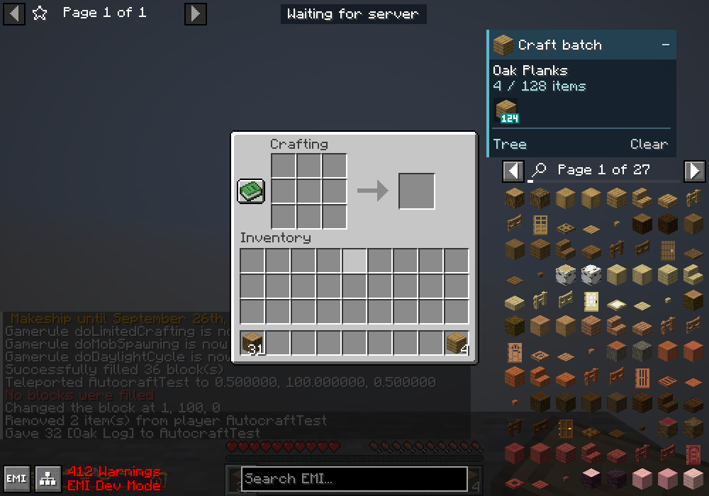

# EMI Autocrafting — NeoForge

Craft an EMI recipe tree in one batch. Set a target quantity and the addon crafts the required intermediates using your inventory and supported connected storage.

A client-side port of [digestlotion's EMI Autocrafting](https://github.com/digestlotion/emiautocrafting) for Minecraft 1.21.1, licensed under GPL-3.0-only.

## Installation

| Requirement | Version |
| --- | --- |
| Minecraft | 1.21.1 |
| Java | 21 |
| NeoForge | 21.1.249 or newer within the 21.1 series |
| EMI | 1.1.24+1.21.1 for NeoForge |

Install EMI and the addon's release JAR in your client's `mods` folder. Replace older addon versions; do not install this port alongside the original. The sources JAR is for development. EMI is pinned to this version because the addon uses its internal recipe-tree API.

The addon is not required on the server. It uses EMI's server-assisted filling when available and ordinary container clicks otherwise.

## Crafting a batch

1. Open a supported crafting interface with an empty cursor. Vanilla grids must be empty; supported storage interfaces can reuse or clear existing ingredients. Keep one empty player inventory slot for collected output and enough room for cleared ingredients.
2. Choose preferred recipes with EMI's hearts and resolve ingredient alternatives in the recipe tree.
3. Hover a recipe output and press **Ctrl+A**. Enter the total quantity you want, then select **Prepare tree**.
4. Press **Ctrl+C** to start. Existing outputs and intermediates count toward the target.

| Shortcut | Action |
| --- | --- |
| Ctrl+A | Prepare a recipe tree |
| Ctrl+C | Start or stop the batch |
| Ctrl+X | Cancel |
| N | Craft one recipe step |

The **Craft batch** panel shows progress and ingredients separately from favourites. Collapse it while crafting, use **Tree** to edit the plan, or **Clear** to remove it. Missing materials appear in a scrollable list before crafting begins.

If a recipe blocks the batch, a detail screen names the item, selected recipe, and dependency path. Use **View recipe** or **Edit tree** to inspect it; **Why?** in the batch panel reopens the last error. **Copy details** includes the recipe identifier and implementation for bug reports.

EMI hearts choose preferred recipes. Choices made inside an individual tree take priority over hearts; removing a sidebar favourite does not change recipe choices. Clear the batch and prepare it again to discard choices made inside that tree. Furnace and machine steps must be supplied as finished ingredients.



Shortcuts, pacing and timeouts are configurable in **Mods → EMI Autocrafting → Config**. Shortcuts do not intercept normal editing in text fields. Manual inventory clicks, closing the interface, disconnecting or changing the recipe tree stop further actions.

## Supported interfaces

- Vanilla crafting tables and the player's 2×2 grid.
- Crafting Station and its adjacent-inventory tabs, including Sophisticated Storage chests.
- Ars Nouveau storage lecterns with the Bookwyrm crafting upgrade and linked inventories.
- Applied Energistics 2 crafting terminals, including AE2WTLib wireless crafting terminals, using stored items.

Storage integrations are optional. The addon supports standard shaped/shapeless recipes, plain KubeJS wrappers, Quark mixed-material recipes, and Sophisticated Core next-tier upgrade recipes that copy settings from the previous upgrade. It does not run processing machines, scripted output/ingredient actions, or AE2 crafting CPU jobs. See [compatibility](docs/COMPATIBILITY.md) for supported versions and limitations.

The next operation starts after the previous one is confirmed. Failed synchronization stops the batch without retrying an uncertain craft; reopen the interface before restarting.

Bookwyrm lecterns and AE2 terminals collect ordinary recipes in bounded batches of up to one output stack per confirmation. A request for 20 chests crafts 20, even with enough wood for more. Matching grid ingredients stay in place; a changed recipe clears the grid in one verified operation. Recipes with returned containers or tools, and **N** single-step mode, keep one execution per confirmation.

AE2 also batches recipes using intermediates in your player inventory, loading the required quantities into its crafting grid. Outputs go into your inventory. Non-stackable items such as complete ME storage cells need one slot each, so large requests stop when there is no room; they are not automatically deposited into connected storage.

## Development

Build with JDK 21:

```sh
./gradlew build
```

Use `gradlew.bat build` on Windows. Release and sources JARs are written to `build/libs`.

[Architecture](docs/ARCHITECTURE.md) · [Testing](docs/TEST-REPORT.md) · [Changelog](CHANGELOG.md) · [Report an issue](https://github.com/IN-Nedev/emiautocrafting-neoforge/issues)

## Credits

Original addon by **digestlotion**. EMI by **Emily Ploszaj and contributors**, installed separately. See [NOTICE.md](NOTICE.md) and [LICENSE](LICENSE).
