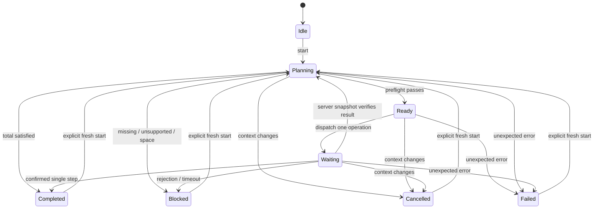

# Execution boundary

`EmiBridge` contains the EMI internals: selected recipe/output, preference and resolution snapshots, bounded MaterialNode projection, native sidebar updates, handler selection and fill. `TreePlanner` owns a single component-aware stock ledger. It allocates sibling alternatives together using a residual flow graph, preserves ancestor reservations and carries batch surplus forward. Each next operation is rebuilt from current inventory.

`MenuPort` accepts only exact vanilla CraftingMenu/InventoryMenu and EMI's exact built-in crafting handlers. It projects an exact one-execution ingredient choice, checks the real shaped/shapeless recipe and selected recipe ID, assembles the expected output and remainders, and reserves space. Shapeless grid-size behaviour is preserved in the exact-ingredient projection.

`JobController` is pure Java and advances on client ticks. Synchronization and remainder-clear operations use the same waiting state but do not count as a crafted step. A confirmed execution is followed by a fresh plan; no loop runs inside a key callback.

The incoming full-menu snapshot is copied after the client packet handler applies it on the Minecraft thread. Matching requires the expected component-aware item multiset, an empty cursor and agreement between the received snapshot and the current menu. Merely returning true from EMI, moving an unrelated slot, or predicting a result locally cannot confirm a craft.

The synchronization request is a vanilla no-op QUICK_MOVE at slot -1 with state ID -1. The inspected 1.21.1 server returns a full menu state for that mismatch. See UPSTREAM-REVIEW.md for the exact methods. Timeouts request a snapshot and quarantine the menu; they never automatically repeat a craft. There is no addon network channel and no server entrypoint.
