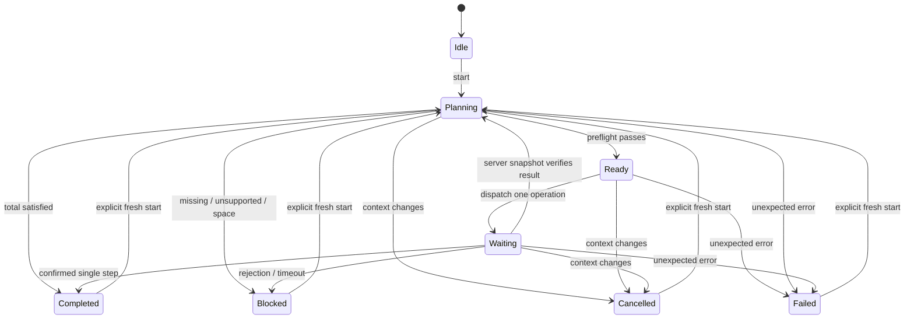

# Execution boundary

`EmiBridge` contains the EMI internals: selected recipe/output, preference and resolution snapshots, bounded MaterialNode projection, native sidebar updates, handler selection and fill. `TreePlanner` owns a single component-aware stock ledger. It allocates sibling alternatives together using a residual flow graph, preserves ancestor reservations and carries batch surplus forward. Each next operation is rebuilt from current inventory.

`MenuPort` accepts exact vanilla CraftingMenu/InventoryMenu with EMI's exact built-in handlers, plus the optional exact menu classes recognized by `StorageCrafting`. It projects an exact one-execution ingredient choice, checks the real shaped/shapeless recipe and selected recipe ID, assembles the expected output and remainders, and reserves space. Shapeless grid-size behaviour is preserved in the exact-ingredient projection.

`CraftingCompatibility` admits the exact vanilla recipe classes and the exact known KubeJS shaped/shapeless wrapper classes with the expected vanilla superclass. For KubeJS it reads public accessors through reflection, requiring an empty ingredient-action list and empty output-modifier string before assembly or remainder evaluation. Unknown wrappers or accessor failures are rejected. KubeJS is not a required dependency. The original recipe still performs matching, so its mirroring rules are retained.

`JobController` is pure Java and advances on client ticks. Synchronization and remainder-clear operations use the same waiting state but do not count as a crafted step. A confirmed execution can plan and dispatch the next operation in the same tick, but dispatch returns immediately and there is at most one dispatch per tick. Extra pacing defaults to zero; each operation must still confirm before another is sent. No crafting loop runs inside a key callback.

The client logout event cancels immediately and clears held-shortcut tracking; cancellation does not depend on a later world tick after disconnect.

The incoming full-menu snapshot is copied after the client packet handler applies it on the Minecraft thread. Each operation has a `StockScope` containing its exact ingredient, output and remainder keys, including reusable inputs with zero net consumption. Matching requires the expected counts for every scoped key, an empty cursor, and agreement between the received snapshot and current grid, result and scoped item slots. CLEAR scopes the moved item. SYNC obtains a fresh full snapshot and checks the grid/result/cursor before planning. Merely returning true from EMI, moving an unrelated slot, or predicting a result locally cannot confirm a craft.

Unused stored items may change metadata, arrive or leave without invalidating an operation that does not touch them. After FILL, capped-source reconciliation runs on the scoped quantities; background quantities are taken from the new inventory. A prepared CRAFT retains its exact scoped expectation while rebasing unrelated stock again before dispatch. Subsequent planning reads current accessible inventory. Relevant losses, missing outputs and changed reusable inputs still cannot confirm; component matching itself is not relaxed.

The synchronization request is a vanilla no-op QUICK_MOVE at slot -1 with state ID -1. The inspected 1.21.1 server returns a full menu state for that mismatch. See UPSTREAM-REVIEW.md for the exact methods. Timeouts request a snapshot and quarantine the menu; they never automatically repeat a craft. There is no addon network channel and no server entrypoint.

## Optional storage protocols

`StorageCrafting` uses optional reflection against the installed versions; there are no hard class references or bundled storage mods. Crafting Station contributes every native adjacent inventory slot, including hidden tabs. Ars supplies its stored-item quantities. AE2 supplies stored amounts from its client repository, excluding craftable-only entries and non-item keys. The player inventory, grid and remote list form a single component-aware stock ledger.

Station fills use EMI with destination NONE; the lectern and AE2 use their own transfer packets. AE2 receives explicit templates with craftMissing=false. A FILL operation requires the exact real grid and result, a new server snapshot and unchanged scoped stock except for bounded material revealed by capped station source slots. The separate CRAFT operation picks one result through the native single-craft protocol and deposits it into an empty player slot. This avoids lectern shift-crafting/refilling multiple recipes. Confirmed output stacks are merged through quantity-preserving CLEAR operations. Exact native grid refills may be reused after a fresh recipe/stock preflight.

`CraftingStationMenuMixin` selects the station's existing client display cache for directions declared by its opening packet. Vanilla full/slot updates and the station's own side-slot packets populate that cache; local click prediction remains native. The alternative native path reads a live block-entity inventory, whose separate updates can overwrite already-synchronized menu quantities. The cache prevents that second source of client state from undoing a transfer. The mixin is optional (`@Pseudo`) and explicitly checks `world.isClientSide`; server inventory access is unchanged. Full-snapshot verification and item conservation remain required.

AE2's `MEStorageScreen` appends `RepoSlot` display entries directly to the client menu, outside its client-slot registry. They and registered client-only slots are excluded from server slot comparisons. Remote inventory updates may arrive separately; confirmation waits for the aggregate quantity change too. Native transfer success alone never confirms consumption.

`JobSidebar` registers an EMI exclusion area and stack provider. A pinned-EMI mixin captures synthetic tree entries into the batch panel and removes their duplicate presentation, leaving ordinary favourites intact. EMI's tree cost presentation receives the accessible storage ledger. The panel supports collapse, paging, tree access and removal. `MissingItemsScreen` shows every planner shortage, with quantities, and requires explicit restart after materials are supplied.

## Capped Crafting Station counts

Crafting Station 2.1.1 clamps `SideContainerSlot.getItem()` to the item's normal stack size, even when a Sophisticated chest contains a larger stack. Transferring one item can therefore turn a visible total of 64 into 65 without creating any material. `StorageCrafting.revealLimits` identifies exact selected inputs in source slots that were and remain saturated. `CappedStock.afterTransfer` accepts only nonnegative gains bounded by those source counts; losses, gains of unrelated materials, and excessive gains fail. The authoritative exact filled grid/result and empty cursor are required first. The next craft's expected stock is rebased by the revealed quantities; its consumption, output and remainder checks remain exact. No uncertain craft is retried.
